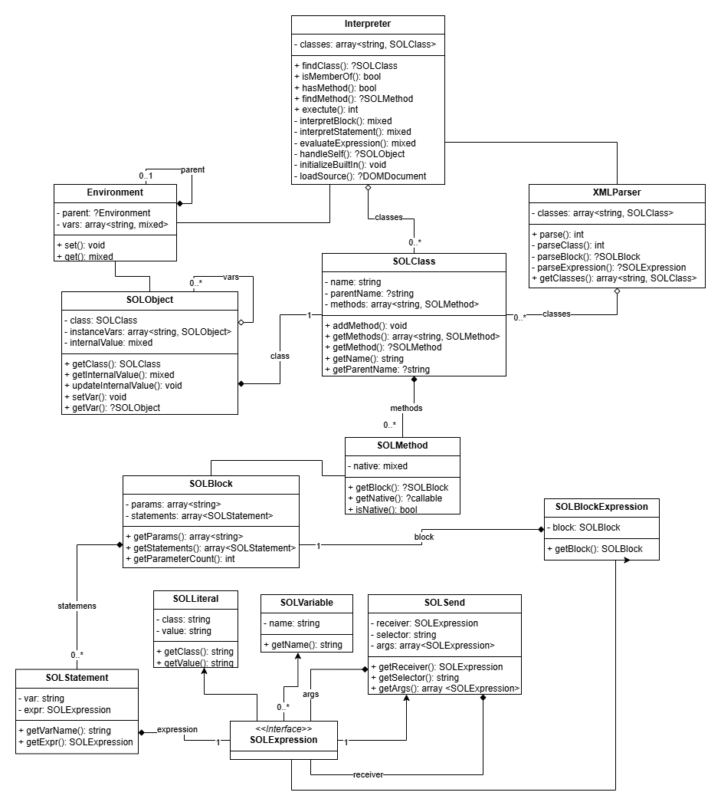
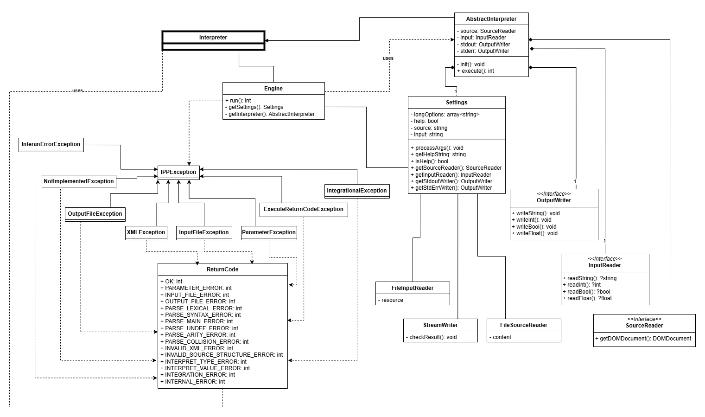
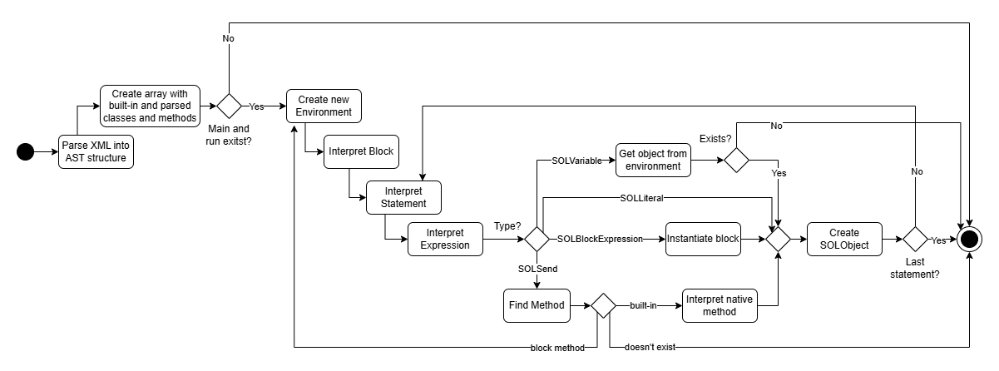

# Table of Contents
## Praser.py
- [Overview](#overview)
- [Key Components](#key-components)
  - [Token](#token)
  - [Lexer](#lexer)
  - [Parser](#parser)
  - [Abstract Syntax Tree](#abstract-syntax-tree)
  - [AST Visitor](#ast-visitor)
  - [Semantic Analyzer](#semantic-analyzer)
  - [XML Visitor](#xml-visitor)
- [Additional Functionality and Extension](#additional-functionality-and-extension)
- [Known Issues and Possible Improvements](#known-issues-and-possible-improvements)
## Interpreter.php
- [Interpreter Overview](#overview)
- [Interpreter Key Components](#key-components)
  - [XMLParser.php](#xmlparserphp)
  - [Environment.php](#environmentphp)
  - [SOLObject.php](#solobjectphp)
  - [SOLMethod.php](#solmethodphp)
  - [SOL Classes (AST nodes)](#sol-classes-ast-nodes)
- [Class Diagram](#class-diagram)
  - [Interpreter Class Diagram](#interpreter-class-diagram)
  - [IPP-Core Class Diagram](#ipp-core-class-diagram)
- [Implementation Details](#implementation-details)
  - [Flow Diagram](#flow-diagram)
  - [XMLParsing](#xmlparsing)
  - [Environment Management](#environment-management)
  - [Object and Method Execution](#object-and-method-execution)
  - [Expression Evaluation](#expression-evaluation)
  - [Error Handling](#error-handling)
- [Known Issues and Limitations](#known-issues-and-limitations)

# Implementation Documentation for Praser.py
---
## Overview
This Python script implements a lexer, parser, and semantic analyzer for a simple imperative object-oriented programming language called **SOL25**. The program reads source code from standard input, tokenizes it, constructs an Abstract Syntax Tree (AST), performs basic syntax and semantic validation, and outputs the XML representation of the AST to the standard output. The implementation is modular, with separate classes for each component.

## Key Components
### Token
The `Token` class represents a token with two attributes: `token_type` and `value`. Additionally, this class includes a method called `check_token`, which verifies whether the token matches an expected type and optionally value.

### Lexer
The `Lexer` class is responsible for tokenizing the source code. It uses a set of predefined regular expressions to identify and categorize tokens. This process utilizes the `re` library to define and match patterns for different token types. The `token_tuple_arr` attribute contains tuples of token types and their corresponding regular expressions. The `compile_regex` method combines all regular expressions into a single regex pattern, which is used to identify matched tokens. The `tokenize` method processes the source code using the compiled regex pattern to find matches and populate an array of tokens. This method returns tuple consisitng of `tokens` (used for parsing) and `first_comment` (used for XML generation).

### Parser
The `Parser` class is responsible for processing an array of tokens obtained from the lexer, constructing the AST, and checking for syntax errors. This class uses multiple methods for recursive descent parsing, with the help of the `consume_token`, `advance_token` and `peek_token` methods, which are responsible for validating `token_type` and traversing the token array. After successfull parsing the method 'parse_program' outputs the root of constructed AST.

### Abstract Syntax Tree
The `ASTNode` class represents the hierarchical structure of the parsed source code. Each node in the tree corresponds to a syntactic construct in the SOL25 language, such as expressions, statements, literals or variables. The AST is constructed during parsing and serves as the foundation for semantic analysis and XML generation.

### **AST Visitor**
This `ASTVisitor`class servers as an interface for implementing `XMLVisitor` and `SemanticAnalyzer`. It defines methods for visiting each AST node. This is usefull for XML generation and Semantic Analysis because it provides same traversal logic, promotes code reusability and maintainability. Each visitor can focus on the specific task without duplicating travelsal logic.

### Semantic Analyzer
The `SemanticAnalyzer` class is responsible for performing semantic analysis on the Abstract Syntax Tree (AST) generated by the parser. It ensures that the program adheres to the semantic rules of the SOL25 language, such as variable scoping, method arity, and inheritance. The analyzer uses a `class_symtable` to track classes, their parents, methods and `scope_stack` to keep track of parameters and declared variables within blocks.

### XML Visitor
The `XMLVisitor` class is used for generating XML representation of AST. It utilizes multiple methods for traversing
the AST and converts its structure into formated XML using `ElementTree` from `xml.etree.ElementTree` module and `minidom` from `xml.dom` module.

## Additional Functionality and Extension
- OOP and Visitor pattern
- Forward Class Declaration Support
- Circular Dependency Prevention
- Prevention for Class, Method and Parameter Redeclaration

## Known Issues and Possible Improvements
- **Variable Shadowing:** Nested blocks do not properly handle variable shadowing, which could lead to unintended behavior.

- **Error Messages:** Error messages could be enhanced with more context (e.g., scope, line in the source code or inheritance chain details).

- **Type Annotations:** Adding more type annotaitons could improve maintainability. Type hints were intentionally used sparingly to keep the code simple and readable, adding them only where necessary for clarity.

- **Performance Optimization:** While the lexer and parser are optimized (e.g., using enums), the semantic analyzer is slower and could benefit from performance improvements.

---

# Implementation Documentation for Interpreter.php

---
## Overview
The SOL25 Interpreter is a PHP-based implementation of the **SOL25** programming language, designed for interpreting object-oriented programs built on top of `ipp-core` framework. Input is an Abstract Syntax Tree (AST) defined in XML format.
SOL25 supports classes, methods, blocks, message sends, and built-in types like `Integer`, `String`, `True`, `False`, `Nil`, and `Block`. The interpreter processes XML input, parses it into an Abstract Syntax Tree, and executes the program starting from the `Main` class’s `run` method.

## Key Components
### XMLParser.php
- Parses XML input into `SOLClass` objects, validating the `<program>` root and class/method structure.
- Converts XML nodes into `SOLBlock`, `SOLStatement`, and `SOLExpression` objects (e.g., SOLLiteral, SOLSend).

### Environmnent.php
- Manages variable scopes using a parent-child hierarchy.
- Used for method and block environments, with `self` binding for the current object.

### SOLObject.php
- Represents an object in the **SOL25** programming language, used by the interpreter to simulate and manipulate objects during program execution.
- Acts as the runtime representation of objects and.
- Holds all the dynamic information an object would have during interpretation: 
    - `array<string, SOLObject>` for storing instance variables (SOLObjects)
    - `mixed` internal value (this can be SOLObject, SOLBlockExpression, string ...)

### SOLMethod.php
- Encapsulates a method's body represeted by a `SOLBlock` node.
- Used for distinction between a block object and a class method.

### SOL Classes (AST nodes)
- Represents a component of the **SOL25** language, used for encapsulation and easier interpretation down the line.
    - **SOLClass:** Represents a class definition, containing blocks.
    - **SOLBlock:** Represents a block of code, containing parameters and statements.
    - **SOLStatement:** Represents a single statement, containing variable and expression. 
    - **SOLExpression:** Interface providing abstraction for all expression types.
        - **SOLLiteral** Represents a literal value (e.g. String, Integer, ...).
        - **SOLVariable** Represents a variable reference by name.
        - **SOLSend** Represents a method call (message send).
        - **SOLBlockExperssion** Wrapper for `SOLBlock`, contains block exclusively assigned to variable.

## Class Diagram
### Interpreter Class Diagram
Below is a detailed class diagram focusing only on the part of the interpreter implemented by me — it does not include other classes or interfaces from the `ipp-core` framework.

### IPP-Core Class Diagram
Below is a class diagram containing all classes and interfaces from the `ipp-core` framework. Relationship descriptions and cardinalities have been omitted for simplicity and to avoid including potentially inaccurate information. Interpreter part and classes associated with it were grouped into one entity to make the diagram more readable and less confusing.

> **Note:** The `ipp-core` itself was not implemented by me, it was provided as part of the assignment.

## Implementation Details
### Flow Diagram
Below is a flow diagram describing overall behavior of interpreter. Details like error handling and additional checks were abstracted to keep the diagram simple and focused on the main flow of the program.

### XMLParsing
The XMLParser class processes XML input, validating the `<program language="SOL25">` root element using DOMDocument (obtained via SourceReader::getDOMDocument()). It:
 - Parses `<class>` nodes into SOLClass objects, storing them in `array<string, SOLClass>`.
 - Converts `<method>` nodes into `SOLMethod` objects, containing either a `SOLBlock` (for interpreted methods) or a native callable (for built-in methods).
 - Recursively processes `<block>`, `<assign>`, and `<expr>` nodes into `SOLBlock`, `SOLStatement`, and `SOLExpression` objects (SOLLiteral, SOLVariable, SOLSend, SOLBlockExpression).

### Environment Management
The Environment class manages variable scopes using a parent-child hierarchy:
 - Each Environment instance holds `array<string, SOLObject>` for variables and an optional parent `Environment` reference.
 - Variables are set via `set(string, SOLObject)` and retrieved via `get(string): ?SOLObject`, searching up the parent chain if not found locally.
 - A special `self` variable binds the current object (SOLObject) in method and block contexts, though its context may not persist correctly in stored blocks ([see Known Issues and Limitations](#known-issues-and-limitations)).
 - Environments are created for method execution (with method parameters) and block evaluation (with block parameters), ensuring proper scoping.

### Object and Method Execution
The Interpreter class drives execution, starting with the **Main** class’s **run** method:
 - **Initialization:** The `initializeBuiltIn()` method defines built-in classes (Object, Integer, String, True, False, Nil, Block) with native methods (e.g., String::print, Integer::plus:) implemented as callables.
 - **Class Management:** Parsed `SOLClass` instances are stored in `array<string, SOLClass>`, with `findClass(string, ?string): ?SOLClass` resolving classes by name and optional value (e.g., for literals).
 - **Object Creation:** `SOLObject` instances are created with a `SOLClass`, an internal value, and instance variables (`array<string, SOLObject>`).
 - **Method Dispatch:** The `findMethod(SOLClass, string): SOLMethod` method locates methods, supporting inheritance by checking parent classes (via `SOLClass::$parentName`). If not found, it throws an `INTERPRET_DNU_ERROR` (code 51).

 - **Execution:** `The execute()` method:
    - Loads XML via `SourceReader`.
    - Parses it with `XMLParser`.
    - Initializes built-in classes.
    - Creates a Main `SOLObject` and a global `Environment`.
    - Calls `Main::run` via `interpretBlock(SOLBlock, SOLObject, array<SOLObject>, Environment): ?SOLObject`.
 - **Message Sends:** SOLSend expressions trigger method calls, evaluating the receiver and arguments as SOLObject instances, then dispatching to the appropriate SOLMethod (native or block-based).

### Expression Evaluation
Expressions (SOLExpression) are evaluated recursively:
 - **SOLLiteral:** Returns a `SOLObject` with the specified class (e.g., Integer) and value (stored as a string).
 - **SOLVariable:** Retrieves a `SOLObject` from the `Environment` using `get(string)`.
 - **SOLSend:** Evaluates the receiver and arguments, dispatches the method, and returns the result.
 - **SOLBlockExpression:** Wraps a `SOLBlock`, creating a `SOLObject` of class `Block` for use in assignments.

### Error Handling
Implementation unfortunately does not make use of `IPPException`. Instead of that, interpreter utilizes `ReturnCode` abstract class to directly terminate the program using `exit`. Errors are reported to stderr via `StreamWriter` (from `OutputWriter::$stderr`).

## Known Issues and Limitations
A few known limitations and deviations from the expected SOL25 behavior are present in this implementation:

- Blocks using `self` might behave unexpectedly. When a block references `self`, it may not always keep the correct object context, especially when stored or passed around.

- Integers and strings are both stored as strings. All literal values are stored as strings internally, which might slow things down and doesn’t strictly follow type separation.

- Built-in classes may not fully match the spec. Some built-in class methods and their initialization don’t exactly follow SOL25 semantics, though they should behave similarly in practice.

- `super` doesn’t work as intended.

- Some methods differ in implementation. A few methods are implemented differently than described in the project spec, but their functionality should still match the expected behavior.